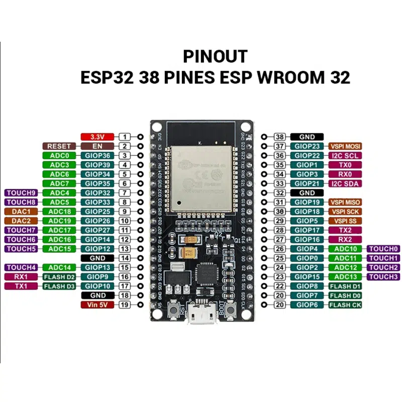
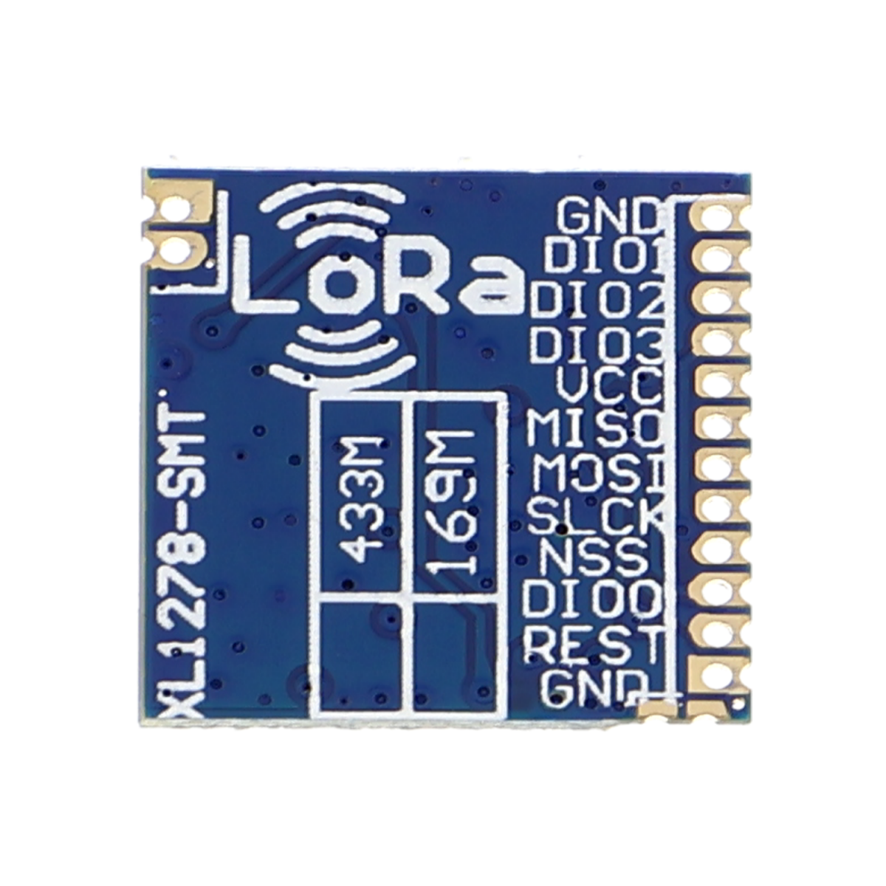
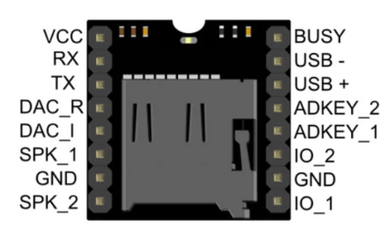

# ESP32 Gong/Ring System

A complete ESP32-based gong scheduling system with LoRa communication, MP3 playback, and web interface management.

## Features

*Основные возможности системы*

- **WiFi Management**: Automatic fallback to Access Point mode if WiFi connection fails
- **Schedule Management**: Add, edit, delete, and manage gong schedules with persistent storage
- **MP3 Playback**: Play gong sounds using the MP3-TF-16P module
- **LoRa Communication**: Send and receive gong triggers via LoRa (XL1278-SMT)
- **Web Interface**: Modern Bootstrap-based web interface for schedule management
- **API Endpoints**: RESTful API for programmatic control
- **Offline Operation**: Works in AP mode when WiFi is unavailable

## Hardware Requirements

*Компоненты, необходимые для сборки системы*

- **ESP32-D0WD-V3** development board
- **XL1278-SMT LoRa module** (433 MHz)
- **MP3-TF-16P audio module**
- **MicroSD card** (for MP3 storage)
- **Speaker/headphones** for audio output (8Ω/4Ω, до 3W)
- **Power supply**: 5V/2A (USB-C или внешний блок питания)

## Коммутация и подключение

*Полная схема подключения всех компонентов системы с изображениями pinout и детальными инструкциями*

### Pinout компонентов

*Изображения pinout всех компонентов системы для удобства подключения*

#### ESP32-D0WD-V3 Pinout

*Основная плата ESP32 с обозначением всех GPIO пинов, питания и интерфейсов*

#### LoRa XL1278-SMT Pinout  

*Модуль LoRa SX1278 с SPI интерфейсом и цифровыми входами/выходами*

#### MP3-TF-16P Pinout

*Аудиомодуль MP3-TF-16P с UART интерфейсом и аудиовыходом*

### Схема подключения компонентов

*ASCII-схема физического подключения всех компонентов системы с указанием всех пинов*

```
                     ┌─────────────────┐
                     │   ESP32-D0WD-V3 │
                     │                 │
                     │ 3.3V ──────────┼─── 3.3V (питание)
                     │ GND ───────────┼─── GND (общий)
                     │                 │
                     │ GPIO5 ──────────┼─── CS (LoRa)
                     │ GPIO14 ─────────┼─── RST (LoRa)
                     │ GPIO2 ──────────┼─── DIO0 (LoRa)
                     │ GPIO18 ─────────┼─── SCK (LoRa)
                     │ GPIO19 ─────────┼─── MISO (LoRa)
                     │ GPIO23 ─────────┼─── MOSI (LoRa)
                     │                 │
                     │ GPIO16 ─────────┼─── TX (MP3)
                     │ GPIO17 ─────────┼─── RX (MP3)
                     │ GPIO4 ──────────┼─── BUSY (MP3)
                     └─────────────────┘
                               │
                     ┌─────────┼─────────┐
                     │         │         │
               ┌─────▼─────┐ ┌─▼─────┐ ┌─▼─────┐
               │ LoRa      │ │ MP3   │ │       │
               │ XL1278-SMT│ │TF-16P │ │       │
               │           │ │       │ │       │
               │ CS ───────┘ │ TX ───┘ │       │
               │ RST ───────┘ │ RX ───┘ │       │
               │ DIO0 ───────┘ │BUSY ──┘ │       │
               │ SCK ───────┘ │       │ │       │
               │ MISO ───────┘ │       │ │       │
               │ MOSI ───────┘ │       │ │       │
               └───────────────┘ └───────┘ │       │
                                           │       │
                                     ┌─────▼─────┐ │
                                     │ Speaker  │ │
                                     │ (8Ω/4Ω)  │ │
                                     │           │ │
                                     │ Audio ────┘ │
                                     │ Output      │
                                     └─────────────┘
```

*Схема физического подключения компонентов*

### Детальное подключение по компонентам

*Подробное описание подключения каждого модуля с изображениями pinout и схемой*

#### 0. ESP32-D0WD-V3 (основная плата)

*Основная плата ESP32 с выделенными пинами для LoRa и MP3 модулей*

**Ключевые пины для проекта:**
*Основные GPIO пины ESP32, используемые в проекте*

- **GPIO2**: LoRa DIO0
- **GPIO5**: LoRa CS  
- **GPIO14**: LoRa RST
- **GPIO16**: MP3 TX (RX)
- **GPIO17**: MP3 RX (TX)
- **GPIO18**: LoRa SCK
- **GPIO19**: LoRa MISO
- **GPIO23**: LoRa MOSI
- **GPIO4**: MP3 BUSY

#### 1. LoRa Module (XL1278-SMT)

*Модуль LoRa SX1278 с SPI интерфейсом для высокоскоростной связи*

**Подключение:**
*Подключение пинов LoRa модуля к ESP32*

- **CS (Chip Select)**: GPIO5
- **RST (Reset)**: GPIO14  
- **DIO0 (Digital I/O 0)**: GPIO2
- **SCK (Serial Clock)**: GPIO18
- **MISO (Master In Slave Out)**: GPIO19
- **MOSI (Master Out Slave In)**: GPIO23

#### 2. MP3 Module (MP3-TF-16P)

*Аудиомодуль MP3-TF-16P с UART интерфейсом для управления воспроизведением*

**Подключение:**
*Подключение пинов MP3 модуля к ESP32*

- **RX (Receive)**: GPIO17 (ESP32 TX)
- **TX (Transmit)**: GPIO16 (ESP32 RX)
- **BUSY (Busy Indicator)**: GPIO4 (изменено с GPIO18 для устранения конфликта)

#### 3. Динамик/Наушники
*Подключение аудиовыхода*

- **Audio Output**: К аудиовыходу MP3-TF-16P
- **Impedance**: 8Ω или 4Ω (рекомендуется)
- **Power**: До 3W (зависит от модуля)

### Питание системы

*Схема питания всех компонентов системы с указанием напряжений, токов и требований*

#### Напряжения питания:
*Напряжения питания для каждого компонента*

- **ESP32**: 3.3V (встроенный стабилизатор)
- **LoRa XL1278-SMT**: 3.3V (питается от ESP32)
- **MP3-TF-16P**: 3.3V (питается от ESP32)
- **Общий ток потребления**: ~200-300mA в режиме ожидания, до 500mA при воспроизведении

#### Источники питания:
*Рекомендуемые источники питания для системы*

1. **USB-C (рекомендуется)**: 5V/1A от компьютера или зарядного устройства
2. **Внешний блок питания**: 5V/1A или 5V/2A для стационарной работы
3. **Li-Po аккумулятор**: 3.7V (ESP32 автоматически понижает до 3.3V)

#### Требования к питанию:
*Технические требования к источнику питания*

- **Минимальное напряжение**: 4.5V (для стабильной работы 3.3V)
- **Рекомендуемое напряжение**: 5V
- **Максимальное напряжение**: 6V (не превышать!)
- **Ток**: Минимум 1A, рекомендуется 2A для надежности

### Порядок подключения

*Пошаговая инструкция по безопасной сборке системы в правильном порядке*

1. **Отключите питание** от всех компонентов
2. **Подключите GND** ко всем модулям
3. **Подключите 3.3V** к LoRa и MP3 модулям
4. **Подключите сигнальные линии** согласно схеме
5. **Подключите динамик** к аудиовыходу MP3 модуля
6. **Подключите питание 5V** к ESP32
7. **Включите систему** и проверьте работу

*Пошаговая инструкция по безопасной сборке*

### Проверка подключения

*Контрольный список для проверки корректности сборки и диагностики проблем*

После сборки проверьте:
*Контрольный список для проверки корректности сборки*

- **LoRa**: Индикатор питания должен гореть
- **MP3**: Светодиод должен мигать при инициализации
- **ESP32**: Синий светодиод должен гореть
- **Serial Monitor**: Должны появляться сообщения инициализации

## Software Setup

*Инструкция по установке и настройке программного обеспечения*

### 1. Install PlatformIO

*Установка среды разработки PlatformIO*

```bash
# Install PlatformIO Core
pip install platformio

# Or install PlatformIO IDE extension in VS Code
```

### 2. Clone and Build

*Клонирование и сборка проекта*

```bash
git clone <repository-url>
cd ring
platformio run
```

*Команды для клонирования и сборки проекта*

### 3. Upload to ESP32

*Загрузка прошивки на ESP32*

```bash
platformio run --target upload
```

*Команда для загрузки прошивки на ESP32*

### 4. Monitor Serial Output

*Мониторинг вывода в Serial Monitor*

```bash
platformio device monitor
```

*Команда для мониторинга Serial Monitor*

## Configuration

*Настройка WiFi и LoRa параметров системы*

### WiFi Settings

*Настройка WiFi подключения*

Edit `webhandler.cpp` to set your WiFi credentials:

```cpp
const char* sta_ssid = "YOUR_WIFI_SSID";
const char* sta_password = "YOUR_WIFI_PASSWORD";
```

*Пример настройки WiFi в webhandler.cpp*

### LoRa Settings

*Настройка параметров LoRa связи*

Modify `lorahandler.cpp` for your frequency and power requirements:

```cpp
#define LORA_FREQUENCY 433E6  // Change to your region's frequency
#define LORA_TX_POWER 20      // Adjust power (0-20 dBm)
```

*Пример настройки LoRa в lorahandler.cpp*

## Usage

*Инструкция по использованию веб-интерфейса и управлению системой*

### Web Interface

*Доступ к веб-интерфейсу управления*

1. **Connect to WiFi**: The ESP32 will attempt to connect to your configured WiFi network
2. **Access Point Mode**: If WiFi fails, connect to "GonggonG" network (password: "vipassana")
3. **Open Browser**: Navigate to the ESP32's IP address (usually 192.168.4.1 in AP mode)

### Schedule Management

*Управление расписанием гонгов*

- **Add Schedule**: Set hour, minute, and description for gong times
- **Edit Schedule**: Modify existing schedule entries
- **Delete Schedule**: Remove unwanted schedule entries
- **Enable/Disable**: Toggle individual schedule entries on/off

### Manual Control

*Ручное управление системой*

- **Play Locally**: Trigger gong sound immediately on this device
- **Send via LoRa**: Broadcast gong trigger to other LoRa devices
- **Refresh**: Update schedule display from server

## API Endpoints

*REST API для программного управления системой*

### GET /schedule
*Получение текущего расписания*

Returns the current schedule as JSON array.

**Response:**
*Пример ответа API*

```json
[
  {
    "id": 1,
    "hour": 6,
    "minute": 0,
    "enabled": true,
    "description": "Morning meditation"
  }
]
```

### POST /schedule
*Добавление нового расписания*

Add a new schedule entry.

**Request Body:**
*Пример тела запроса*

```json
{
  "hour": 6,
  "minute": 0,
  "description": "Morning meditation"
}
```

### PUT /schedule
*Редактирование существующего расписания*

Edit an existing schedule entry.

**Request Body:**
*Пример тела запроса для редактирования*

```json
{
  "id": 1,
  "hour": 6,
  "minute": 30,
  "description": "Morning meditation (updated)"
}
```

### DELETE /schedule?id={id}
*Удаление расписания по ID*

Delete a schedule entry by ID.

### POST /play
*Локальное воспроизведение гонга*

Trigger local gong playback.

### POST /play-lora
*Отправка триггера гонга через LoRa*

Send gong trigger via LoRa.

## LoRa Message Format

*Формат сообщений для LoRa связи между устройствами*

Messages are sent with a type header and JSON payload:
*Формат LoRa сообщений*

```
Type:Payload
```

**Example:**
*Пример LoRa сообщения*

```
1:{"type":"gong","timestamp":1234567890,"device":"ESP32_Gong"}
```

**Message Types:**
*Типы сообщений LoRa*

- `1`: Gong trigger
- `2`: Schedule synchronization
- `3`: Status/health check

## File Structure

*Структура проекта и назначение файлов*

```
ring/
├── data/
│   └── index.html          # Web interface
├── src/
│   ├── main.cpp            # Main application logic
│   ├── webhandler.cpp      # WiFi and web server
│   ├── lorahandler.cpp     # LoRa communication
│   ├── mp3handler.cpp      # MP3 playback control
│   └── schedule.cpp        # Schedule management
├── include/
│   ├── webhandler.h        # Web handler declarations
│   ├── lorahandler.h       # LoRa handler declarations
│   ├── mp3handler.h        # MP3 handler declarations
│   └── schedule.h          # Schedule declarations
├── platformio.ini          # PlatformIO configuration
└── README.md               # This file
```

*Структура файлов проекта*

## Troubleshooting

*Решение распространенных проблем и отладка системы*

### Common Issues

*Распространенные проблемы и их решения*

1. **WiFi Connection Fails**
   *Проблемы с WiFi подключением*

   - Check SSID and password in `webhandler.cpp`
   - Verify WiFi network availability
   - System will automatically switch to AP mode

2. **LoRa Not Working**
   *Проблемы с LoRa связью*

   - Verify pin connections
   - Check frequency settings for your region
   - Ensure proper power supply

3. **MP3 Not Playing**
   *Проблемы с воспроизведением MP3*

   - Check audio connections
   - Verify MP3 files are on SD card
   - Check BUSY pin connection (GPIO4)
   - Verify no pin conflicts with LoRa (GPIO18)

4. **Web Interface Not Loading**
   *Проблемы с веб-интерфейсом*

   - Check if SPIFFS is properly initialized
   - Verify `index.html` is in `data/` folder
   - Check serial monitor for error messages

### Serial Debug Output

*Настройка отладочного вывода в Serial Monitor*

Enable debug output by setting in `platformio.ini`:
*Настройка уровня отладки*

```ini
build_flags = -DCORE_DEBUG_LEVEL=3
```

## Development

*Руководство по разработке и расширению функциональности*

### Adding New Features

*Руководство по добавлению новых функций*

1. **New API Endpoints**: Add handlers in `webhandler.cpp`
2. **New LoRa Message Types**: Extend message handling in `lorahandler.cpp`
3. **Additional Audio Controls**: Extend `mp3handler.cpp`

### Testing

*Методы тестирования и проверки работоспособности*

- Use PlatformIO's built-in testing framework
- Test LoRa communication with multiple devices
- Verify schedule persistence across reboots

## License

*Информация о лицензии проекта*

This project is open source. Please check the license file for details.

## Contributing

*Как внести свой вклад в развитие проекта*

1. Fork the repository
2. Create a feature branch
3. Make your changes
4. Test thoroughly
5. Submit a pull request

*Пошаговый процесс внесения изменений в проект*

## Support

*Получение помощи и поддержки по проекту*

For issues and questions:
*Получение помощи и поддержки*

1. Check the troubleshooting section
2. Review serial monitor output
3. Open an issue on the repository
4. Check ESP32 and LoRa documentation

---

**Note**: This system is designed for meditation centers, temples, or personal use. Ensure compliance with local regulations for LoRa frequency usage.

*Важная информация о соответствии нормативным требованиям*
